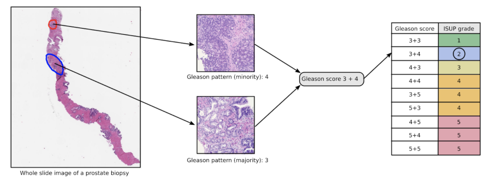

This [challenge](https://www.kaggle.com/c/prostate-cancer-grade-assessment) was about identifying cancerous tissues from benign ones and rate its severity(0 to 6), indicating severity of prostrate cancer. This pushes the frontiers of application of deep learning and medical imaging methods to histopathology.  

  
                                                 [image source](https://www.kaggle.com/c/prostate-cancer-grade-assessment)

### Approach:-  

- **Data description & processing:-**

The images provided are Whole Slide Images(WSI), high resolution images and thus cannot be directly processed by deep learning algorithms. Thus, a [technique](https://developer.ibm.com/technologies/data-science/articles/an-automatic-method-to-identify-tissues-from-big-whole-slide-images-pt1/) which has produced promising results over recent advancements in preprocessing the WSI images was used, which divides the entire image over a grid, generating tiles of the image, and then intelligently selects a few tiles(12) based on how important each tile would be in determining the result. Efficiently sampling informative and representative patches is critical to achieving good performance. Moreover, all tiles are labelled with the label from the original WSI image and then later fed to algorithms, which formulates the problem to be a *Deep Multiple Instance Learning* one where a data instance is split into smaller parts and used to inform the model.  
Also, images were augmented with transforms like random flip to overcome overfitting and failing to generalise on unseen data.  

The quantity used to measure the severity of prostrate cancer is the *isup grade*. It is obtained from *gleason scores* indicating cancer type: 0, 3, 4, or 5. After a given WSI is graded, the most prevalent and the second most prevalent cancerous tissues are considered to construct the *ISUP grade* as shown in the above figure.

- **Models:-**
- [x] 'facebookresearch/semi-supervised-ImageNet1K-models',model='resnext50_32x4d_ssl'--------0.45 kappa score  
- [x] 'zhanghang1989/ResNeSt', model='resnest50'                                      --------0.60 kappa score  
- [x] Se_Resnext_50_4-32                                                              --------0.57 kappa score
- [x] Inception net-b0                                                                 --------0.91 kappa  score

- **Training:-**
  - Method-1  
  Only the isup grade was used as the target to train the model, and it resulted in a better score than using gleason scores that is discussed next.
