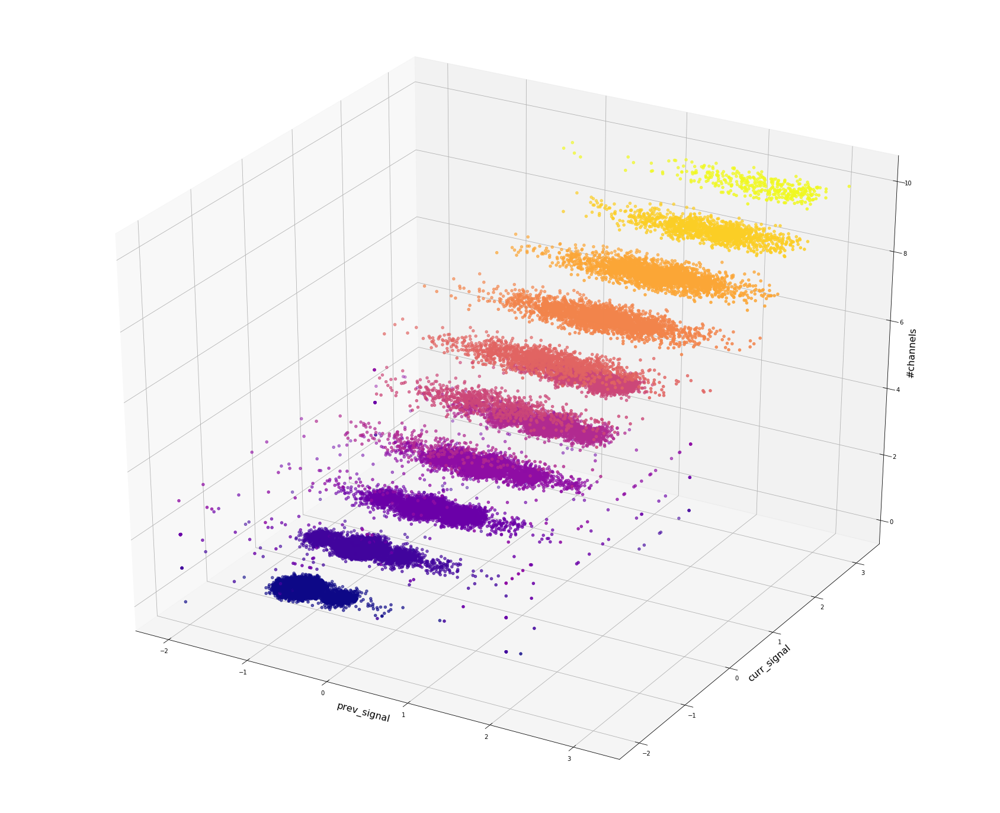

Many diseases, including cancer, are believed to have a contributing factor in common, the **Ion channels**, which are pore-forming proteins present in animals and plants. When ion channels open, they pass electric currents. Determining the number of channels that open is critical to the study of diseases.Existing methods of detecting these state changes are slow and laborious. These difficulties limit the volume of ion channel current analysis that can be used in research. Scientists hope that machine learning could enable rapid automatic detection of ion channel current events in raw data.  
https://www.kaggle.com/c/liverpool-ion-switching/    

#### Approach:  
The channels are classified broadly into 2 categories, depending on whether they have a low probability of opening(low conductance) or a high probability of opening(high conductance):-  

1. Batch1 and Batch2 represent low-probability channels: binary classification  
  -- the data instances recorded in batch1 and batch2 correspond to either one channel being open or closed, hence the name          low-probability channels.  
  -- Model-1 is dedicated to modelling data from batch1 and batch2 only.  
  
2.Other Batches represnet high-probabaility channels: multi-class classification  
  -- the data instances recorded in batch3 upto batch10 correspond to either multiple channels, upto 10 being open, or none          being open i.e. closed, hence the name high-probability channels.  
  -- Model-2 is dedicated to modelling data from batch3 until batch10.  
  

### Model1: 
  DecisionTree classifying a channel as either open or closed.
### Model2:  
  1. XGBoost: gives ~46% accuracy.  
  2. Feed-forward neural network with 2 hidden layers: gives 51% accuracy.  
  3. 1D-CNN: 81% accuracy  
  4. 2 models, one for batch-5 and batch-10 and the other for batches 3,4,6,7,8,9: 86% accuracy  
  5. 3 BiLSTMs: 92.0 accuracy  
  
  
